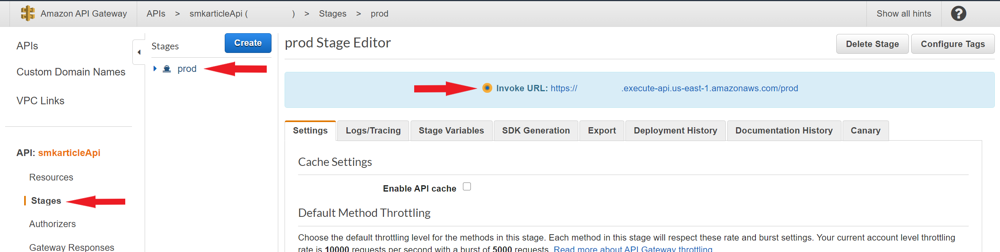
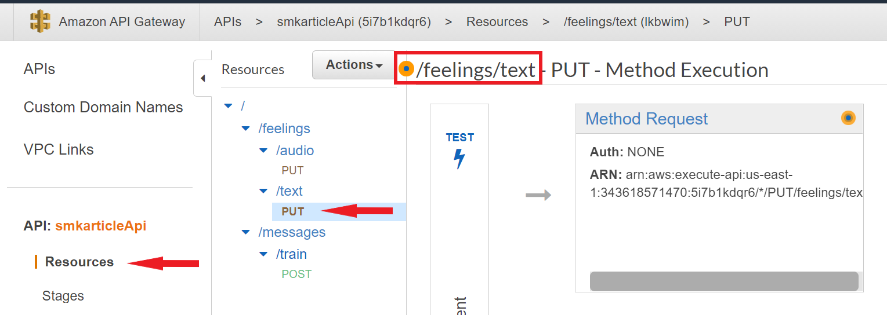
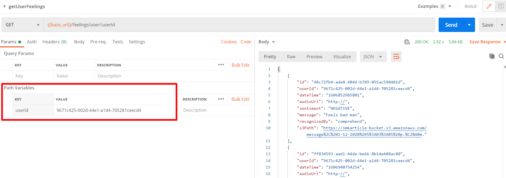

# Building a 'Mental Health Monitoring' App with AWS AI Services - Part I

You can find the complete [article](https://medium.com/southworks/building-a-mental-health-monitoring-app-with-aws-ai-services-part-i-fa7566c6a3a5) describing the scenario tackled with this reference implementation.

## Overview

This Reference Implementation Setup script using CDK, that includes AWS services like Lambda, Step Functions, S3, Amazon Lex, Amazon Comprehend, and API Gateway.
Furthermore, as it is a minimal version of the solution presented in the article, this project has neither authentication nor authorization.

## Folder structure

```
(root)
    ├─── cdk
    |   ├── audio-workflow-script
    |   ├── bin
    |   ├── lib
    |   |   └── lambdas/src
    |   |       ├── data
    |   |       ├── handlers
    |   |       └── utils
    |   └── test
    └─── lex-bot
        └── src
```

- cdk:
  - bin: Contains autogenerated CDK assets to run the CDK toolkit.
  - lib
    - lambdas/src
      - data: Contains all related to data handlings like contexts, and repositories.
      - handlers: Contains the Lambdas for each endpoint to receive and handle its corresponding request. It validates the data and passes it to the repositories. Finally, it gets the result and sends the response.
      - utils: Contains small snippets to be used throughout the app to make it reusable.
  - test: Contains tests to have code consistency and ensure regression.
- lex-bot
  - src: Contains feeling examples in JSON format to train the Lex bot.

## Environment setup

This section will cover how to build and deploy an AWS stack with all required services in your account. Keep in mind that you need an AWS account with permissions to create new resources.

### Configuration files

The first step will be to update `configParameters` and `config` files. You will need the Access Key, the Secret Access Key, and the Account ID with your corresponding AWS credentials. Also, you are free to change the region of the stack creation. Keep in mind that the pointed region should have availability for all used services.

Yo may find these configuration files in the following paths:

- `cdk/configParameters.json`
- `cdk/lib/lambdas/src/config.json`
- `lex-bot/config.json`

> **Note:** we recommend to keep the default values for `resourcesPrefix`, `stackName`, `bucketName`, and `neutralsBucketName` to fully understand the documents related to this project.

### Deploy Lex Bot

Once the configuration files are updated, you must deploy the Lex bot to AWS and register its Slots that will be used for sentiment detection. To do so, use a command line interface and navigate to the `lex-bot` location and execute the `node createBot` command.

### Deploy AWS Infrastructure

First, you must install the libraries and dependencies for the CDK scripts. To do so, use a command line interface and navigate to the `cdk` location and execute the `npm install` command.

> **Note:** we take for granted that you have installed Node and npm on your local machine.

From the `cdk` location, execute the `npm run cdk deploy` command in order to deploy the article-cdk-stack file. The `cdk.json` file tells the CDK Toolkit how to execute your app. This will build a Cloud Formation template to create all needed resources for this project.

#### Useful commands

- `npm run build` compile typescript to js
- `npm run watch` watch for changes and compile
- `npm run test` perform the jest unit tests
- `npm run cdk deploy` deploy this stack to your default AWS account/region
- `npm run cdk diff` compare deployed stack with current state
- `npm run cdk synth` emits the synthesized CloudFormation template

### AWS API endpoints

You may find the **API.postman_collection.json** Postman collection in root folder of this project. In contains the requests needed to execute the endpoints to the text workflows.

## Process Kinesis with Lex workflow

This workflow allows us to send a request with a message (text or audio type) via Kinesis, be received by a Lambda function, start a Step function that involves Amazon Lex and Comprehend services, and finally, save the result in an S3 bucket. Both text and audio message types will be analyzed in depth below.

### Using Text

For the text message type, you will only need to get the associated URL from AWS API Gateway. This service auto generates an URL to invoke a resource, you may find this URL in the _Stages_ section, selecting the prod stage (generated by default).



<br>

Then, you may get the URI path to execute the text flow by going to the _Resources_ section and selecting the PUT action in the feelings/text path.



<br>

Finally, open Postman and create a new PUT request, add the URL and URI to the bar. Then, in the body tab, select the raw data type with JSON encode option to add a valid payload. Below, an example payload with the required fields to perform a request. Note that the `userId` field is a UUID value to represent the user, and you may change it without problems.

#### Example payload

```json
{
  "Data": [
    {
      "inputText": "<TEXT MESSAGE>",
      "userId": "9671c425-002d-44e1-a1d4-705281ceecd4",
      "audioUrl": "http://"
    }
  ]
}
```

### Using Audio

There is a script to run the audio workflow. There are two sample audio files: one positive and one negative.

The script calls the feelings/audio endpoint passing the audio recording in a Buffer containing the MP3 formatted audio encoded in ASCII in the property named `inputText`.

To run the script follow these steps:
- Create an `.env` file based on `.env.template` and:
  - Replace the placeholder URL with the correct one, which can be found in AWS on API Gateway -> smkarticleApi -> Stages -> prod -> Invoke URL. The URL should be constructed as {invoke URL}/feelings/audio.
- Switch to the audio-workflow-script directory:  
  `cd .\cdk\audio-workflow-script\`
- Then run the script either with the positive or negative audio file:
   - for the positive audio file run:
  `npm run audio-positive`
   - for the negative audio file run:
  `npm run audio-negative`

This script runs the whole audio workflow. To see the process on AWS, do the following:

1. Go to [AWS Console](https://console.aws.amazon.com/)
2. In the AWS Console search for Step Functions
3. Then click on `smkarticleprocessKinesistoAudio`

## Get participant feelings workflow

Based on the [Process Kinesis with Lex workflow](#Process-Kinesis-with-Lex-workflow), it is needed to retrieve all the stored data in a friendly way. You can reach to this data using the GET /feelings/user/{userId} endpoint (also implementated in the API Gateway).

This endpoint works as follows:

- userId parameter reaches the getUserFeelings Lambda function
- Lambda uses AWS SDK to perform a connection with the DynamoDB table
- Finally, the data is mapped in a user-friendly response


