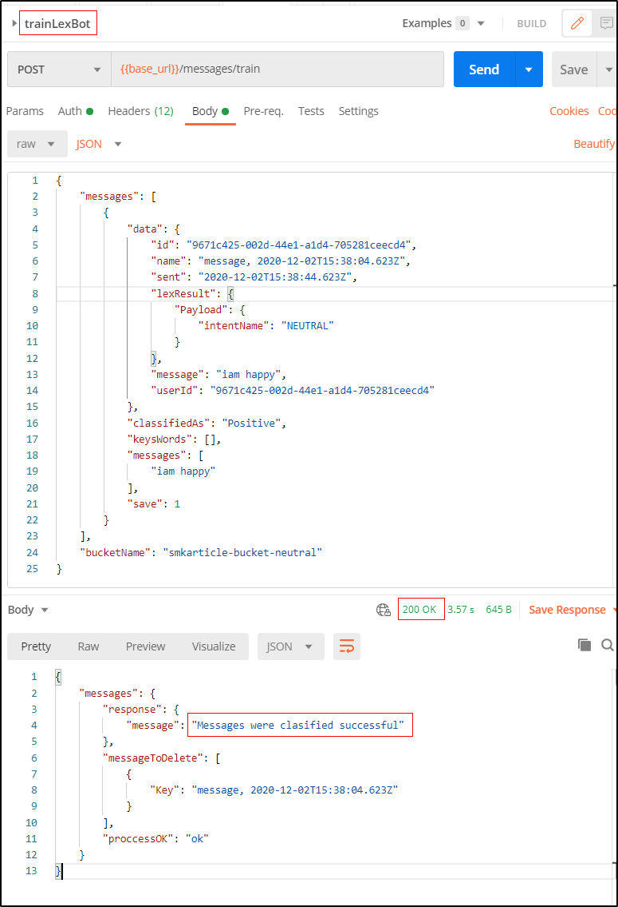

# How to train the Lex bot

## Table of Contents

- [Postman request](#Postman-request)
- [Payload example](#Payload-example)
- [Payload fields' description](#Payload-fields'-description)

## Postman request

You may find the **API.postman_collection.json** Postman collection in root folder of this project, which contains a __trainLexBot__ request. To train the Lex bot send this request with a payload containing the same fields as in the [payload example](#payload-example), modifying the values according to the original message you want to modify. 

## Payload example

Considering a message in the [smkarticle-bucket-neutral](https://s3.console.aws.amazon.com/s3/buckets/smkarticle-bucket-neutral?region=us-east-1&tab=objects) buck with the text  __iam happy__ that was labeled as __NEUTRAL__, but it was determined that it should be positive. Therefore, a request was sent to the __messages/train__ endpoint with the following payload:

```json
{
	"messages": [
		{
			"data": {
				"id": "9671c425-002d-44e1-a1d4-705281ceecd4",
				"name": "message, 2020-12-02T15:38:04.623Z",
				"sent": "2020-12-02T15:38:44.623Z",
				"lexResult": {
					"Payload": {
						"intentName": "NEUTRAL"
					}
				},
				"message": "iam happy",
				"userId": "9671c425-002d-44e1-a1d4-705281ceecd4"
			},
			"classifiedAs": "Positive",
			"keysWords": [],
			"messages": [
				"iam happy"
			],
			"save": 1
		}
	],
	"bucketName": "smkarticle-bucket-neutral"
}
```



## Payload fields' description:

- id: The user id.

- name: The name of the message for which the sentiment should be modified. It can be found in the details of the message stored in [smkarticle-bucket-neutral](https://s3.console.aws.amazon.com/s3/buckets/smkarticle-bucket-neutral?region=us-east-1&tab=objects) (or [smkarticle-bucket](https://s3.console.aws.amazon.com/s3/buckets/smkarticle-bucket?region=us-east-1&tab=objects)) under the **Key** field.

- sent: The moment in which the original message was sent. It can be found in the message details, in the **Key** field next to "message".

- intentName: The classification that __Lex__ applied to the message.

- message: The text of the original message.

- userId: The user id.

- classifiedAs: The sentiment label to which the message should be associated. E.g. if the message was labelled "NEUTRAL" when it should have been "POSITIVE", this field should be "POSITIVE".

- keysWords: An array of words to help the bot identify the intent.

- messages: An array containing the text of the original message.

- save: A boolean that determines whether the message should be saved or not.

- bucketName: The name of the bucket where the original message is.
